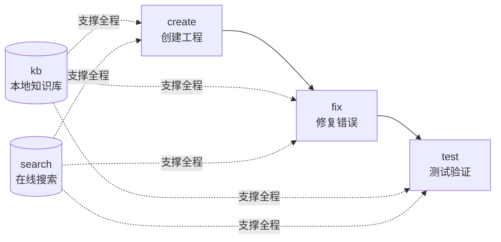

# FLUTTER-DEV —— Flutter/Dart 应用开发技能

[](LICENSE)

flutter-dev 是一个面向 AI agent 的 Flutter/Dart 应用开发 skill。它聚合 5 个子命令，覆盖 Flutter 应用开发全生命周期：**create**（创建工程）→ **fix**（修复错误）→ **test**（测试验证），辅以 **kb**（本地 Qdrant 知识库）与 **search**（在线文档搜索）作为知识支撑。跨平台支持 Linux / Windows / macOS，无 MCP 依赖。

## 5 个子命令速览

| 子命令   | 一句话功能                                                                  | 主要脚本                                                   |
| -------- | --------------------------------------------------------------------------- | ---------------------------------------------------------- |
| `create` | Python subprocess 调用 `flutter create`，参数化项目名/组织名/平台           | `scripts/create/create_project.py`                         |
| `fix`    | 三轨修复路由：analyzer（`dart analyze`）/ runtime（stack trace）/ layout    | `scripts/fix/{run_analyzer,parse_stack_trace,diagnose_layout}.py` |
| `test`   | 平台检测 + Flutter SDK/Dart SDK 探测 + `flutter test` / `flutter integration_test` | `scripts/test/{platform,cli}.py`                           |
| `kb`     | 本地 Qdrant 知识库：9 子动作（query/build/reindex/merge/link-auto/…）       | `scripts/kb/*.py` + 预构建库                               |
| `search` | 本地 sidebars 关键词匹配 + URL 内容抓取（docs.flutter.cn / api.flutter-io.cn / pub.dev） | `scripts/search/{_http,search,detail}.py`                  |

子命令路由表、触发词、各子动作完整流程见 [SKILL.md](SKILL.md) 与 [references/commands/](references/commands/)。

## 完整流程链路



**协同要点**：kb query 命中无 description → search detail 取正文 → 回填 description + 双向链接；fix 遇未知 API → search 查官方文档；test 失败 → 错误日志 → fix 轨道诊断。

## 安装

### Python 依赖（kb / search / test 子命令）

```bash
pip install -r requirements.txt
```

依赖清单：

- **必需**：`qdrant-client`、`rank-bm25`、`httpx`、`sentence-transformers`、`modelscope`
- **可选**：`flashrank`（重排）、`openai`（云端嵌入模型）

### Flutter SDK（create / fix / test 子命令）

需自行安装 Flutter SDK（含 Dart SDK）：

```bash
# 安装指引
# https://flutter.dev/docs/get-started/install
```

安装后 `python3 -m scripts.test.cli check` 会验证 Flutter SDK / Dart SDK / 平台可用性。

## config.json 配置

仓库根 `config.json` 是 kb 子命令的唯一配置源（缺失时 agent 经 AskUserQuestion 询问，选默认则生成默认配置并用预构建库）。

| 字段 | 默认值 | 说明 |
| ---- | ------ | ---- |
| `embed_model` | `sentence-transformers/paraphrase-MiniLM-L3-v2` | 嵌入模型（本地 ST / `openai://` 云端） |
| `embed_dim` | `384` | 嵌入维度（必须匹配模型） |
| `embed_source` | `modelscope` | 模型下载源（`modelscope` / `''` HF） |
| `embed_base_url` | `""` | 云端 OpenAI 兼容 base_url |
| `embed_api_key` | `""` | 云端 API key |
| `rerank_model` | `flashrank` | 重排模型（`flashrank` / `openai://…`） |
| `rerank_source` | `local` | 重排模型源 |
| `db_path` | `data/flutter.qdrant` | Qdrant 本地库路径 |
| `collection` | `flutter_docs` | Qdrant 集合名 |
| `sidebars_dir` | `sidebars` | sidebar 解析目录 |
| `endpoints.docs` | `docs.flutter.cn` | docs 端点 |
| `endpoints.api` | `api.flutter-io.cn` | api 端点 |
| `endpoints.pub` | `pub.dev` | pub 包端点 |
| `query.default_top_k` | `5` | 默认返回 top-k |
| `query.bm25_weight` | `0.3` | BM25 融合权重 |
| `query.vector_weight` | `0.7` | 向量融合权重 |

> 🔴 **CHECKPOINT**：修改 `embed_model` / `embed_dim` 后 MUST 运行 `python3 scripts/kb/build_db.py` 全量重建向量库。未重建直接 query 会因维度不匹配报错。

## 预构建知识库

仓库附带预构建的 `data/flutter.qdrant/`（本地 Qdrant 持久化目录），由默认嵌入模型生成，开箱即用：

- 直接运行 `python3 -m scripts.kb.cli query --question "Widget 生命周期"` 即可查询
- 若 `embed_model` 为默认值且 `data/flutter.qdrant` 存在，直接用预构建库，不重算向量

### 一键重建 / 切换模型后重索引

```bash
# 完全重建（从 sidebars/ 重新解析、重新嵌入）
python3 scripts/kb/build_db.py

# 仅重嵌入（content_hash 变化或 description 回填的文档）
python3 -m scripts.kb.cli reindex

# 强制全量重嵌入（切换 embed_model 后必跑）
python3 -m scripts.kb.cli reindex --force
```

切换 `embed_model` 的标准流程：

1. 编辑 `config.json` 修改 `embed_model` / `embed_dim` / `embed_source`
2. 运行 `python3 scripts/kb/build_db.py`（全量重建）
3. 验证查询：`python3 -m scripts.kb.cli query --question "测试"`

## 快速命令参考

```bash
# create —— 创建工程
python3 -m scripts.create.create_project --name <project_name> --out <输出目录> \
  [--org com.example] [--platforms android,ios,web]

# fix —— 三轨道修复
python3 -m scripts.fix.run_analyzer --project <dir>            # dart analyze JSON 解析
python3 -m scripts.fix.parse_stack_trace --trace "<stack trace string>"
python3 -m scripts.fix.diagnose_layout --log "<flutter layout error log>"

# test —— 测试验证
python3 -m scripts.test.cli check                               # 检测 Flutter/Dart SDK + 平台
python3 -m scripts.test.cli run --unit --path test/             # flutter test（单元/widget）
python3 -m scripts.test.cli run --integration --path integration_test/  # flutter integration_test

# kb —— 9 子动作
python3 -m scripts.kb.cli query --question "<关键词>" [--top-k 5]
python3 -m scripts.kb.cli build
python3 -m scripts.kb.cli merge --other <other.qdrant>
python3 -m scripts.kb.cli reindex --force
python3 -m scripts.kb.cli update-description <id> "<desc>"
python3 -m scripts.kb.cli update-links --id <id> --content "<markdown>"
python3 -m scripts.kb.cli link-auto [--threshold 0.9] [--max-per-doc 10]
python3 -m scripts.kb.cli migrate-embed-model [--model <name>]
python3 -m scripts.kb.cli config

# search —— 在线搜索
python3 -m scripts.search.search "<关键词>" [--doc-type docs|api|ai-docs] [--top-k 10]
python3 -m scripts.search.detail <url>

# 一键重建预构建库（切换 embed_model 后必跑）
python3 scripts/kb/build_db.py
```

## 文档分类

3 类 sidebar 文档分类存储于 `sidebars/`：

| doc_type | sidebar 文件 | 内容 |
| -------- | ------------ | ---- |
| `docs` | `flutter-docs.md` | Flutter 官方开发文档 |
| `api` | `flutter-api.md` | Flutter API 参考 |
| `ai-docs` | `flutter-ai-docs.md` | AI 辅助文档 |

## 平台支持矩阵

| 子命令 | Linux | Windows | macOS |
| ------ | :---: | :-----: | :---: |
| `create` | ✅ | ✅ | ✅ |
| `fix` | ✅ | ✅ | ✅ |
| `test`（单元/widget） | ✅ | ✅ | ✅ |
| `test`（integration） | ✅ | ✅ | ✅ |
| `kb` | ✅ | ✅ | ✅ |
| `search` | ✅ | ✅ | ✅ |

Flutter 跨平台，所有平台都支持 `flutter test` + `flutter integration_test`，无 MCP 依赖。

## 仓库结构

```
flutter-dev/
├── SKILL.md                          # 5 子命令路由器 + 通用规则
├── config.json                       # kb 配置（模型/库/端点）
├── requirements.txt                  # Python 依赖
├── LICENSE                           # MIT
├── sidebars/                         # 3 个 flutter-*-sidebar.md
├── data/
│   └── flutter.qdrant/               # 预构建 Qdrant 本地库
├── references/
│   ├── commands/{create,fix,test,kb,search}.md  # 5 子命令流程文档
│   ├── flutter-ui/                   # Flutter UI 规范
│   ├── flutter-skills/               # 10 个 Flutter 技能模块
│   ├── dart-skills/                  # 12 个 Dart 技能模块
│   ├── grammar/                      # Dart 语法规范
│   └── error-fixes/                  # 错误修复
└── scripts/
    ├── create/                       # create_project.py + tests/
    ├── fix/                          # run_analyzer + parse_stack_trace + diagnose_layout
    ├── test/                         # platform.py + cli.py
    ├── kb/                           # 知识库模块 + build_db.py
    └── search/                       # _http.py + search.py + detail.py
```

## 测试

```bash
python3 -m pytest scripts/ -v
```

测试使用 `FakeEmbedder`（SHA1 派生的确定性向量）替代真实模型下载，确保离线可运行。

## 开发规则

`create` 子命令生成工程代码、`fix` 子命令的 grammar 轨道、`test` 的 `flutter analyze` 都 MUST 遵循 [`references/dev-rules.md`](references/dev-rules.md)，包含三类强制规则：

1. **Dart 语言规范**（类型系统/空安全/异步/模式匹配/枚举/类/mixin/泛型，约 40 条）
2. **Flutter API 使用规范**（Widget 生命周期/BuildContext/State 管理/路由/主题/dispose，约 15 条）
3. **Flutter UI 规范**（Material 3/Cupertino/响应式/无障碍/性能，约 10 条）

## 禁止事项

1. **禁止硬编码模型名/路径** —— embed_model/rerank_model/db_path 全部从 config.json 读
2. **禁止跨子命令直连** —— create 产出的工程不经 fix/test 验证不算完成
3. **禁止简化实现** —— 双向链接必须真正双向写入；description 回填必须重算向量
4. **禁止静默吞错** —— 所有脚本错误显式上报（非零退出码/errors 字段/异常）
5. **禁止跨模型向量空间混用** —— 同维度不同 embed_model 的向量空间不兼容，query/merge/reindex 入口 MUST 校验

## License

MIT，见 [LICENSE](LICENSE)。
