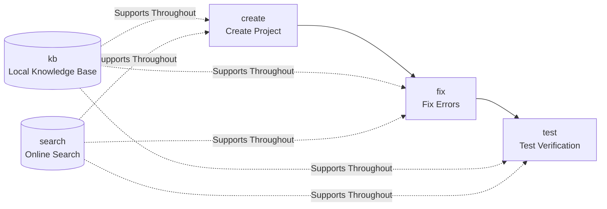

# FLUTTER-DEV — Flutter/Dart Application Development Skill

[](LICENSE)

flutter-dev is an AI-agent-oriented Flutter/Dart application development skill. It aggregates 5 subcommands covering the full Flutter application development lifecycle: **create** (project creation) → **fix** (error fixing) → **test** (test verification), supplemented by **kb** (local Qdrant knowledge base) and **search** (online documentation search) as knowledge support. Cross-platform support for Linux / Windows / macOS, no MCP dependency.

## 5 Subcommands Overview

| Subcommand | One-line Function | Main Scripts |
| ---------- | ----------------- | ------------ |
| `create` | Python subprocess calls `flutter create`, parameterized project name/org/platform | `scripts/create/create_project.py` |
| `fix` | Three-track fix routing: analyzer (`dart analyze`) / runtime (stack trace) / layout | `scripts/fix/{run_analyzer,parse_stack_trace,diagnose_layout}.py` |
| `test` | Platform detection + Flutter SDK/Dart SDK probing + `flutter test` / `flutter integration_test` | `scripts/test/{platform,cli}.py` |
| `kb` | Local Qdrant knowledge base: 9 sub-actions (query/build/reindex/merge/link-auto/...) | `scripts/kb/*.py` + pre-built database |
| `search` | Local sidebars keyword matching + URL content fetching (docs.flutter.cn / api.flutter-io.cn / pub.dev) | `scripts/search/{_http,search,detail}.py` |

See [SKILL.md](SKILL.md) and [references/commands/](references/commands/) for subcommand routing tables, trigger words, and complete sub-action workflows.

## Complete Workflow Chain



**Coordination Points**: kb query hits with no description → search detail fetches body text → backfill description + bidirectional links; fix encounters unknown API → search official docs; test failure → error logs → fix track diagnosis.

## Installation

### Python Dependencies (kb / search / test subcommands)

```bash
pip install -r requirements.txt
```

Dependency list:

- **Required**: `qdrant-client`, `rank-bm25`, `httpx`, `sentence-transformers`, `modelscope`
- **Optional**: `flashrank` (reranking), `openai` (cloud embedding models)

### Flutter SDK (create / fix / test subcommands)

Flutter SDK (including Dart SDK) must be installed separately:

```bash
# Installation guide
# https://flutter.dev/docs/get-started/install
```

After installation, `python3 -m scripts.test.cli check` will verify Flutter SDK / Dart SDK / platform availability.

## config.json Configuration

The root `config.json` is the sole configuration source for the kb subcommand (when missing, the agent asks via AskUserQuestion; if default is chosen, a default config is generated and the pre-built database is used).

| Field | Default Value | Description |
| ----- | ------------- | ----------- |
| `embed_model` | `sentence-transformers/paraphrase-MiniLM-L3-v2` | Embedding model (local ST / `openai://` cloud) |
| `embed_dim` | `384` | Embedding dimension (must match model) |
| `embed_source` | `modelscope` | Model download source (`modelscope` / `''` HF) |
| `embed_base_url` | `""` | Cloud OpenAI-compatible base_url |
| `embed_api_key` | `""` | Cloud API key |
| `rerank_model` | `flashrank` | Rerank model (`flashrank` / `openai://...`) |
| `rerank_source` | `local` | Rerank model source |
| `db_path` | `data/flutter.qdrant` | Qdrant local database path |
| `collection` | `flutter_docs` | Qdrant collection name |
| `sidebars_dir` | `sidebars` | Sidebar parsing directory |
| `endpoints.docs` | `docs.flutter.cn` | Docs endpoint |
| `endpoints.api` | `api.flutter-io.cn` | API endpoint |
| `endpoints.pub` | `pub.dev` | Pub package endpoint |
| `query.default_top_k` | `5` | Default top-k return |
| `query.bm25_weight` | `0.3` | BM25 fusion weight |
| `query.vector_weight` | `0.7` | Vector fusion weight |

> 🔴 **CHECKPOINT**: After modifying `embed_model` / `embed_dim`, you MUST run `python3 scripts/kb/build_db.py` to fully rebuild the vector database. Querying without rebuilding will cause dimension mismatch errors.

## Pre-built Knowledge Base

The repository includes a pre-built `data/flutter.qdrant/` (local Qdrant persistence directory), generated by the default embedding model, ready to use out of the box:

- Run `python3 -m scripts.kb.cli query --question "Widget lifecycle"` directly to query
- If `embed_model` is the default value and `data/flutter.qdrant` exists, the pre-built database is used directly without recalculating vectors

### One-click Rebuild / Re-index After Model Switch

```bash
# Full rebuild (re-parse and re-embed from sidebars/)
python3 scripts/kb/build_db.py

# Re-embed only (documents with changed content_hash or backfilled descriptions)
python3 -m scripts.kb.cli reindex

# Force full re-embed (required after switching embed_model)
python3 -m scripts.kb.cli reindex --force
```

Standard workflow for switching `embed_model`:

1. Edit `config.json` to modify `embed_model` / `embed_dim` / `embed_source`
2. Run `python3 scripts/kb/build_db.py` (full rebuild)
3. Verify query: `python3 -m scripts.kb.cli query --question "test"`

## Quick Command Reference

```bash
# create — Create project
python3 -m scripts.create.create_project --name <project_name> --out <output_dir> \
  [--org com.example] [--platforms android,ios,web]

# fix — Three-track fix
python3 -m scripts.fix.run_analyzer --project <dir>            # dart analyze JSON parsing
python3 -m scripts.fix.parse_stack_trace --trace "<stack trace string>"
python3 -m scripts.fix.diagnose_layout --log "<flutter layout error log>"

# test — Test verification
python3 -m scripts.test.cli check                               # Detect Flutter/Dart SDK + platform
python3 -m scripts.test.cli run --unit --path test/             # flutter test (unit/widget)
python3 -m scripts.test.cli run --integration --path integration_test/  # flutter integration_test

# kb — 9 sub-actions
python3 -m scripts.kb.cli query --question "<keyword>" [--top-k 5]
python3 -m scripts.kb.cli build
python3 -m scripts.kb.cli merge --other <other.qdrant>
python3 -m scripts.kb.cli reindex --force
python3 -m scripts.kb.cli update-description <id> "<desc>"
python3 -m scripts.kb.cli update-links --id <id> --content "<markdown>"
python3 -m scripts.kb.cli link-auto [--threshold 0.9] [--max-per-doc 10]
python3 -m scripts.kb.cli migrate-embed-model [--model <name>]
python3 -m scripts.kb.cli config

# search — Online search
python3 -m scripts.search.search "<keyword>" [--doc-type docs|api|ai-docs] [--top-k 10]
python3 -m scripts.search.detail <url>

# One-click rebuild pre-built database (required after switching embed_model)
python3 scripts/kb/build_db.py
```

## Documentation Categories

3 types of sidebar documents are stored in `sidebars/`:

| doc_type | Sidebar File | Content |
| -------- | ------------ | ------- |
| `docs` | `flutter-docs.md` | Flutter official development documentation |
| `api` | `flutter-api.md` | Flutter API reference |
| `ai-docs` | `flutter-ai-docs.md` | AI-assisted documentation |

## Platform Support Matrix

| Subcommand | Linux | Windows | macOS |
| ---------- | :---: | :-----: | :---: |
| `create` | ✅ | ✅ | ✅ |
| `fix` | ✅ | ✅ | ✅ |
| `test` (unit/widget) | ✅ | ✅ | ✅ |
| `test` (integration) | ✅ | ✅ | ✅ |
| `kb` | ✅ | ✅ | ✅ |
| `search` | ✅ | ✅ | ✅ |

Flutter is cross-platform; all platforms support `flutter test` + `flutter integration_test`, no MCP dependency.

## Repository Structure

```
flutter-dev/
├── SKILL.md                          # 5-subcommand router + general rules
├── config.json                       # kb configuration (model/database/endpoints)
├── requirements.txt                  # Python dependencies
├── LICENSE                           # MIT
├── sidebars/                         # 3 flutter-*-sidebar.md files
├── data/
│   └── flutter.qdrant/               # Pre-built Qdrant local database
├── references/
│   ├── commands/{create,fix,test,kb,search}.md  # 5-subcommand workflow docs
│   ├── flutter-ui/                   # Flutter UI specifications
│   ├── flutter-skills/               # 10 Flutter skill modules
│   ├── dart-skills/                  # 12 Dart skill modules
│   ├── grammar/                      # Dart syntax specifications
│   └── error-fixes/                  # Error fixes
└── scripts/
    ├── create/                       # create_project.py + tests/
    ├── fix/                          # run_analyzer + parse_stack_trace + diagnose_layout
    ├── test/                         # platform.py + cli.py
    ├── kb/                           # Knowledge base module + build_db.py
    └── search/                       # _http.py + search.py + detail.py
```

## Testing

```bash
python3 -m pytest scripts/ -v
```

Tests use `FakeEmbedder` (deterministic vectors derived from SHA1) instead of real model downloads, ensuring offline testability.

## Development Rules

`create` subcommand project code, `fix` subcommand grammar track, and `test`'s `flutter analyze` MUST follow [`references/dev-rules.md`](references/dev-rules.md), which contains three categories of mandatory rules:

1. **Dart Language Specifications** (type system/null safety/async/pattern matching/enums/classes/mixins/generics, ~40 rules)
2. **Flutter API Usage Specifications** (Widget lifecycle/BuildContext/State management/routing/themes/dispose, ~15 rules)
3. **Flutter UI Specifications** (Material 3/Cupertino/responsive/accessibility/performance, ~10 rules)

## Prohibited Actions

1. **No hardcoded model names/paths** — embed_model/rerank_model/db_path all read from config.json
2. **No cross-subcommand direct linking** — project output from create is not considered complete without fix/test verification
3. **No simplified implementations** — bidirectional links must truly write both directions; description backfill must recalculate vectors
4. **No silent error swallowing** — all script errors must be explicitly reported (non-zero exit code / errors field / exceptions)
5. **No cross-model vector space mixing** — vector spaces from different embed_models with the same dimension are incompatible; query/merge/reindex entry points MUST validate

## License

MIT, see [LICENSE](LICENSE).
