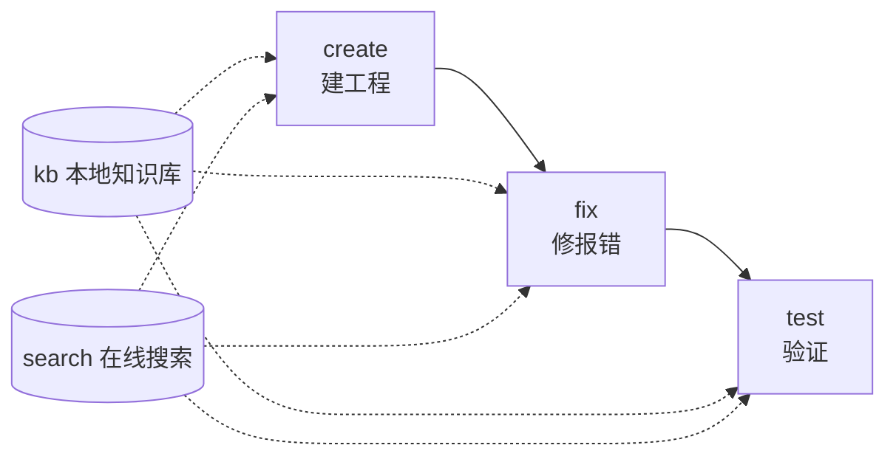

# flutter-dev — Flutter/Dart 应用开发技能

> 面向 AI agent 的 Flutter/Dart 应用开发技能：create（建工程）→ fix（修报错）→ test（跑测试）覆盖开发生命周期，kb（本地 Qdrant 知识库）与 search（在线文档搜索）提供知识支撑。跨 Linux / Windows / macOS，无 MCP 依赖。

[](https://github.com/Kirky-X/flutter-dev/releases)
[](LICENSE)

中文 | [English](README_EN.md)

## ✨ 功能特性

| 子命令 | 说明 | 主脚本 |
| ------ | ---- | ------ |
| `create` | Python subprocess 调 `flutter create`，项目名/组织名/平台参数校验（`--name/--org/--platforms/--force`） | `scripts/create/create_project.py` |
| `fix` | 三轨道按症状路由：analyzer（`dart analyze` JSON 解析）/ runtime（Dart 堆栈解析）/ layout（RenderFlex 溢出等布局诊断） | `scripts/fix/{run_analyzer,parse_stack_trace,diagnose_layout}.py` |
| `test` | 平台检测 + Flutter/Dart SDK 探测 + `flutter test`（unit/widget）+ integration_test | `scripts/test/{platform,cli}.py` |
| `kb` | 本地 Qdrant 知识库，**14 个子动作**（`--help` 实测）：query / build / merge / reindex / update-description / update-links / link-auto / migrate-embed-model / config / fetch-content / update-content / fetch-and-update / migrate-context / refresh-expired | `scripts/kb/` |
| `search` | 本地 sidebars 关键词匹配 + URL 正文抓取（docs.flutter.cn / api.flutter-io.cn / pub.dev），HTML→Markdown 清洗 | `scripts/search/{_http,search,detail}.py` |

**预构建知识库**：仓库自带 `data/flutter.qdrant/`（meta 实测 `doc_count: 495`，384 维，collection `flutter_docs`），3 类侧栏文档分库存储（docs / api / ai-docs，3 个 sidebar 文件均随仓库分发，开箱即可查询）。

**config.example.json 初始化流程**：`config.json` 含 API key 不入仓库。缺失时脚本回退内置默认值（stderr 提示）；需要自定义云端模型/key 时执行 `cp config.example.json config.json` 后编辑。embed_model 为默认值且预构建库存在 → 直接用预构建库，不重算向量。

**协作闭环**：kb query 命中无 description 的文档 → `search detail <url>` 抓正文 → `kb update-description` 回填并重算向量；fix 遇未知 API → search 官方文档；test 失败 → 错误日志 → fix 轨道诊断。create 产物未经 fix/test 验证不算完成。



## 📦 安装

```bash
# 同步到 agent 技能目录（~/.zcode/skills 与 ~/.claude/skills）
bash scripts/sync-skills.sh flutter-dev

# 首跑前置：kb / search / test 的 Python 依赖
pip install -r requirements.txt   # qdrant-client / rank-bm25 / httpx / sentence-transformers / modelscope
# 方式三：远程安装（GitHub 仓库）
npx skills add Kirky-X/flutter-dev --agent claude-code -y
```

create / fix / test 需另装 [Flutter SDK](https://docs.flutter.dev/get-started/install)（含 Dart），装后用 `python3 -m scripts.test.cli check` 验证。修改 `embed_model` / `embed_dim` 后必须 `python3 scripts/kb/build_db.py` 全量重建，否则维度不匹配报错。

## 🚀 快速开始

所有命令假设 cwd = skill 根目录（`python3 -m` 需要它定位 `scripts` 包）。

```bash
# fix — 粘贴 Dart 堆栈定位错误（实测：NoSuchMethodError 正确识别到文件与行号）
python3 -m scripts.fix.parse_stack_trace --log-text "<堆栈文本>"   # 或 --log-file <路径>
python3 -m scripts.fix.run_analyzer <project_dir>                  # dart analyze 三轨道入口
python3 -m scripts.fix.diagnose_layout --log-text "<布局错误日志>"

# test — 环境自检（实测输出 platform/enabled_tools/flutter_installed 字段）
python3 -m scripts.test.cli check
python3 -m scripts.test.cli run --project-path <project_dir>       # flutter test
python3 -m scripts.test.cli run --project-path <project_dir> --integration

# kb — 本地语义查询（预构建库 495 向量）
python3 -m scripts.kb.cli query --question "<关键词>" [--top-k 5] [--doc-type docs|api|ai-docs] [--rerank]

# search — 本地侧栏匹配（实测离线命中：'Widget lifecycle' → 4 条结果）
python3 -m scripts.search.search "<关键词>" [--doc-type docs|api|ai-docs] [--top-k 10]
python3 -m scripts.search.detail <url>
```

子命令路由表与触发词见 [SKILL.md](SKILL.md)，各子命令完整工作流见 `references/commands/{create,fix,test,kb,search}.md`。

## ✅ 测试与验证

实测 `python3 -m pytest scripts/ -q`：**143 passed**（测试文件随仓库分发，`FakeEmbedder` 用 SHA1 派生确定性向量，离线可跑）。另实测通过：`create_project --help`、`fix.parse_stack_trace` 真实日志解析、`test.cli check`（本机无 Flutter SDK 时如实输出 `flutter_installed: false`）、`search` 本地匹配。

## 📁 目录结构

```
flutter-dev/
├── SKILL.md                    # 5 子命令路由 + 失败模式表 + 禁止事项
├── config.example.json         # 配置模板（cp 为 config.json 后编辑）
├── requirements.txt            # Python 依赖
├── skill.json                  # 技能元数据（版本/触发标签）
├── sidebars/                   # flutter-docs.md / flutter-api.md / flutter-ai-docs.md
├── data/
│   ├── flutter.qdrant/               # 预构建 Qdrant 库（495 向量）
│   └── flutter.qdrant.meta.json      # 库元数据（doc_count/embed_model）
├── references/
│   ├── commands/               # 5 子命令工作流文档
│   ├── dev-rules.md            # Dart/Flutter API/UI 三类强制规则
│   ├── flutter-skills/ dart-skills/ flutter-ui/ grammar/ error-fixes/
└── scripts/
    ├── create/  fix/  test/    # create_project / run_analyzer 等 / platform+cli
    ├── kb/                     # cli.py（14 子动作）+ build_db.py
    └── search/                 # _http.py + search.py + detail.py
```

## 🔮 边界

- 鸿蒙 / HarmonyOS / ArkTS 用 **hap-dev**，本 skill 不触发
- 开发规范：create 产物代码、fix 语法轨道、`flutter analyze` 必须遵循 [`references/dev-rules.md`](references/dev-rules.md)（Dart 语言 / Flutter API / UI 三类强制规则）
- 不硬编码模型名/路径（一律读 config.json）；不同 embed_model 同维度的向量空间不兼容，query/merge/reindex 入口强校验、失配即响亮报错；双向链接必须真实写两侧；错误禁止静默吞掉（非零退出码 / errors 字段 / 异常）

## 📄 License 与归属

[MIT](LICENSE) © Flutter-DEV Contributors。完整失败模式与回退表见 [SKILL.md](SKILL.md)。
