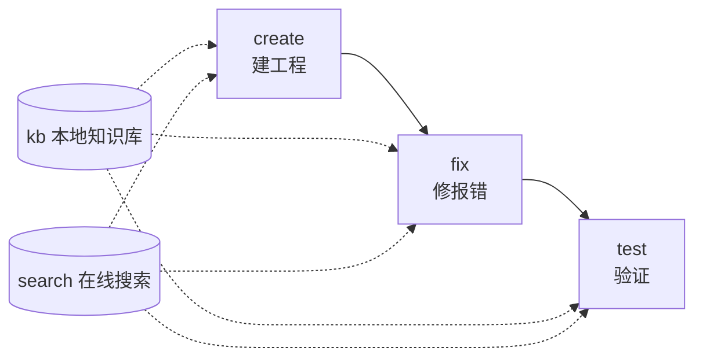

# flutter-dev — Flutter/Dart Application Development Skill

> A Flutter/Dart application development skill for AI agents: create (scaffold a project) → fix (resolve errors) → test (run tests) covers the development lifecycle, with kb (local Qdrant knowledge base) and search (online documentation search) providing knowledge support. Cross-platform across Linux / Windows / macOS, no MCP dependency.

English | [中文](README.md)

[](https://github.com/Kirky-X/flutter-dev/releases)
[](LICENSE)

## ✨ Features

| Subcommand | Description | Main script |
| ------ | ---- | ------ |
| `create` | Calls `flutter create` via Python subprocess, with project-name/org/platform parameter validation (`--name/--org/--platforms/--force`) | `scripts/create/create_project.py` |
| `fix` | Three symptom-routed tracks: analyzer (`dart analyze` JSON parsing) / runtime (Dart stack-trace parsing) / layout (RenderFlex overflow and other layout diagnostics) | `scripts/fix/{run_analyzer,parse_stack_trace,diagnose_layout}.py` |
| `test` | Platform detection + Flutter/Dart SDK detection + `flutter test` (unit/widget) + integration_test | `scripts/test/{platform,cli}.py` |
| `kb` | Local Qdrant knowledge base, **14 sub-actions** (measured via `--help`): query / build / merge / reindex / update-description / update-links / link-auto / migrate-embed-model / config / fetch-content / update-content / fetch-and-update / migrate-context / refresh-expired | `scripts/kb/` |
| `search` | Local sidebars keyword matching + URL body fetching (docs.flutter.cn / api.flutter-io.cn / pub.dev), HTML→Markdown cleaning | `scripts/search/{_http,search,detail}.py` |

**Pre-built knowledge base**: the repo ships `data/flutter.qdrant/` (meta measured `doc_count: 495`, 384 dims, collection `flutter_docs`); 3 sidebar document categories are stored in separate collections (docs / api / ai-docs; all 3 sidebar files ship with the repo, queryable out of the box).

**config.example.json initialization flow**: `config.json` contains API keys and is not committed. When it is missing, scripts fall back to built-in defaults (with a stderr notice); to customize a cloud model/key, run `cp config.example.json config.json` and edit. When embed_model is the default and the pre-built database exists → use the pre-built database directly, without recomputing vectors.

**Collaboration loop**: when kb query hits a document without a description → `search detail <url>` fetches the body → `kb update-description` fills it in and recomputes vectors; when fix hits an unknown API → search the official docs; test failure → error log → fix-track diagnosis. create output is not considered done until validated by fix/test.



## 📦 Installation

```bash
# 同步到 agent 技能目录（~/.zcode/skills 与 ~/.claude/skills）
bash scripts/sync-skills.sh flutter-dev

# 首跑前置：kb / search / test 的 Python 依赖
pip install -r requirements.txt   # qdrant-client / rank-bm25 / httpx / sentence-transformers / modelscope
```

create / fix / test additionally require the [Flutter SDK](https://docs.flutter.dev/get-started/install) (Dart included); after installation, verify with `python3 -m scripts.test.cli check`. After changing `embed_model` / `embed_dim`, a full rebuild with `python3 scripts/kb/build_db.py` is mandatory, otherwise a dimension-mismatch error is raised.

## 🚀 Quick Start

All commands assume cwd = the skill root (`python3 -m` needs it to locate the `scripts` package).

```bash
# fix — 粘贴 Dart 堆栈定位错误（实测：NoSuchMethodError 正确识别到文件与行号）
python3 -m scripts.fix.parse_stack_trace --log-text "<堆栈文本>"   # 或 --log-file <路径>
python3 -m scripts.fix.run_analyzer <project_dir>                  # dart analyze 三轨道入口
python3 -m scripts.fix.diagnose_layout --log-text "<布局错误日志>"

# test — 环境自检（实测输出 platform/enabled_tools/flutter_installed 字段）
python3 -m scripts.test.cli check
python3 -m scripts.test.cli run --project-path <project_dir>       # flutter test
python3 -m scripts.test.cli run --project-path <project_dir> --integration

# kb — 本地语义查询（预构建库 495 向量）
python3 -m scripts.kb.cli query --question "<关键词>" [--top-k 5] [--doc-type docs|api|ai-docs] [--rerank]

# search — 本地侧栏匹配（实测离线命中：'Widget lifecycle' → 4 条结果）
python3 -m scripts.search.search "<关键词>" [--doc-type docs|api|ai-docs] [--top-k 10]
python3 -m scripts.search.detail <url>
```

For the subcommand routing table and trigger words see [SKILL.md](SKILL.md); for each subcommand's complete workflow see `references/commands/{create,fix,test,kb,search}.md`.

## ✅ Tests & Verification

Measured `python3 -m pytest scripts/ -q`: **143 passed** (test files ship with the repo; `FakeEmbedder` uses SHA1-derived deterministic vectors, so it runs offline). Also measured passing: `create_project --help`, `fix.parse_stack_trace` parsing a real log, `test.cli check` (honestly reports `flutter_installed: false` when the machine has no Flutter SDK), and local `search` matching.

## 📁 Directory Structure

```
flutter-dev/
├── SKILL.md                    # 5 子命令路由 + 失败模式表 + 禁止事项
├── config.example.json         # 配置模板（cp 为 config.json 后编辑）
├── requirements.txt            # Python 依赖
├── skill.json                  # 技能元数据（版本/触发标签）
├── sidebars/                   # flutter-docs.md / flutter-api.md / flutter-ai-docs.md
├── data/
│   ├── flutter.qdrant/               # 预构建 Qdrant 库（495 向量）
│   └── flutter.qdrant.meta.json      # 库元数据（doc_count/embed_model）
├── references/
│   ├── commands/               # 5 子命令工作流文档
│   ├── dev-rules.md            # Dart/Flutter API/UI 三类强制规则
│   ├── flutter-skills/ dart-skills/ flutter-ui/ grammar/ error-fixes/
└── scripts/
    ├── create/  fix/  test/    # create_project / run_analyzer 等 / platform+cli
    ├── kb/                     # cli.py（14 子动作）+ build_db.py
    └── search/                 # _http.py + search.py + detail.py
```

## 🔮 Boundaries

- HarmonyOS / ArkTS belongs to **hap-dev**; this skill does not trigger for it
- Development rules: code produced by create, the fix analyzer track, and `flutter analyze` must follow [`references/dev-rules.md`](references/dev-rules.md) (three categories of mandatory rules: Dart language / Flutter API / UI)
- No hardcoded model names/paths (always read config.json); vector spaces of different embed_model values are incompatible even at the same dimension — the query/merge/reindex entry points enforce validation and fail loudly on mismatch; bidirectional links must genuinely be written on both sides; errors must never be silently swallowed (non-zero exit code / errors field / exception)

## 📄 License & Attribution

[MIT](LICENSE) © Flutter-DEV Contributors. For the complete failure-mode and fallback table, see [SKILL.md](SKILL.md).
