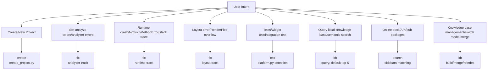
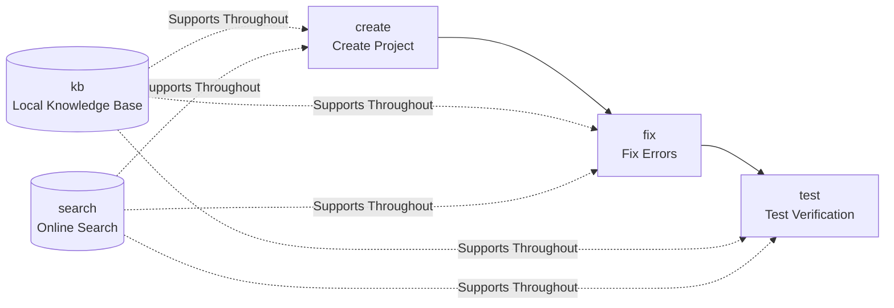

# FLUTTER-DEV — Flutter/Dart Application Development Skill

Five subcommands cover the full Flutter application development lifecycle: create (project creation) → fix (error fixing) → test (test verification), supplemented by kb (local knowledge base) and search (online documentation search) as knowledge support.

- **create** (upstream) — Python subprocess calls `flutter create`, with project name/org/platform validation + output directory generation. Solves "**how to start** a project".
- **fix** (repair) — Aggregates three fix tracks: analyzer (`dart analyze` static error code routing), runtime (Dart stack trace parsing), layout (RenderFlex overflow / unbounded constraints / missing Material ancestor). Routes by symptom. Solves "**how to fix errors**".
- **test** (verification) — Platform detection + Flutter SDK/Dart SDK probing + `flutter test` (unit/widget tests) + `flutter integration_test` (integration tests). Full functionality on all platforms (Flutter cross-platform, no MCP dependency). Solves "**is it correct**".
- **kb** (knowledge base) — Local Qdrant knowledge base, 3 categories of sidebar documents stored separately (docs/api/ai-docs), vector embedding (default `paraphrase-MiniLM-L3-v2`, switchable between ModelScope/cloud) + bm25 keyword index + optional FlashRank reranking. Lazy description filling + vector backfilling + bidirectional links. Sub-actions: query/build/merge/reindex/update-description/update-links/link-auto/migrate-embed-model/config. Solves "**what can be queried locally**".
- **search** (online search) — Local sidebars keyword matching + URL content fetching (docs.flutter.cn / api.flutter-io.cn / pub.dev), HTML→Markdown cleaning. Serves as one of the legitimate channels for kb description/link filling. Solves "**what's available online**".

## Subcommand Routing

**TL;DR Decision Tree** (quick routing; complete workflows in the table below):



| User Intent | Subcommand | Complete Workflow |
| ----------- | ---------- | ----------------- |
| Create / new Flutter project (from scratch/scaffold) | create | [`references/commands/create.md`](references/commands/create.md) |
| dart analyze errors / type errors / static check errors | fix | [`references/commands/fix.md`](references/commands/fix.md) |
| Runtime crash / NoSuchMethodError / stack trace | fix | [`references/commands/fix.md`](references/commands/fix.md) |
| Layout error / RenderFlex overflow / layout anomaly | fix | [`references/commands/fix.md`](references/commands/fix.md) |
| Dart syntax issues / TS→Dart differences / syntax permission | fix | [`references/commands/fix.md`](references/commands/fix.md) |
| Widget / layout / state management / Flutter UI code | kb | [`references/commands/kb.md`](references/commands/kb.md) + `references/flutter-ui/` |
| Unit tests / widget test / integration test | test | [`references/commands/test.md`](references/commands/test.md) |
| Query local knowledge base / Flutter doc semantic search | kb | [`references/commands/kb.md`](references/commands/kb.md) |
| Online search Flutter docs / API / pub packages | search | [`references/commands/search.md`](references/commands/search.md) |
| Knowledge base management (build/merge/reindex/switch model) | kb | [`references/commands/kb.md`](references/commands/kb.md) |

After entering a subcommand, follow its workflow documentation. Checkpoints, edge cases, and delivery checklists are all within each subcommand's document — **this router does not contain the main workflow**.

## First Run (Environment Setup)

```bash
cd {SKILL_DIR}                     # skill 根目录；下文所有 python3 -m 命令均以此为 cwd
pip install -r requirements.txt   # qdrant-client / rank-bm25 / httpx / sentence-transformers / modelscope 等
```

- `python3 -m scripts.*` 依赖 cwd=skill 根目录来定位 `scripts` 包；在其他目录执行会报 `No module named scripts`。
- `config.json` 含 API key、不入仓库：缺失时脚本回退内置默认值（stderr 提示）；需要自定义（云端模型/key）时执行 `cp config.example.json config.json` 后编辑。

## Quick Command Reference

所有命令均假设已执行 `cd {SKILL_DIR}`；逐条复制时保留 `cd {SKILL_DIR} && ` 前缀。flag 与各脚本 `--help` 输出一一对应。

```bash
# create
cd {SKILL_DIR} && python3 -m scripts.create.create_project --name <project_name> --out <output_dir> \
    [--org com.example] [--platforms android,ios,web] [--force]   # --force: 跳过"输出目录非空"检查

# fix（三条轨道：analyzer→run_analyzer.py | runtime→parse_stack_trace.py | layout→diagnose_layout.py）
cd {SKILL_DIR} && python3 -m scripts.fix.run_analyzer <project_dir>    # dart analyze JSON 解析（工程路径为位置参数）
cd {SKILL_DIR} && python3 -m scripts.fix.parse_stack_trace --log-text "<Dart stack trace 文本>"   # 或 --log-file <日志路径>
cd {SKILL_DIR} && python3 -m scripts.fix.diagnose_layout --log-text "<flutter layout 错误日志>"    # 或 --log-file <日志路径>

# test
cd {SKILL_DIR} && python3 -m scripts.test.cli check                          # 检测 Flutter/Dart SDK + 平台
cd {SKILL_DIR} && python3 -m scripts.test.cli run --project-path <project_dir>              # flutter test（unit/widget）
cd {SKILL_DIR} && python3 -m scripts.test.cli run --project-path <project_dir> --integration # flutter test integration_test/
cd {SKILL_DIR} && python3 -m scripts.test.cli run --project-path <project_dir> --test-file test/widget_test.dart  # 单文件

# kb（子动作：query/build/merge/reindex/update-description/update-links/link-auto/migrate-embed-model/
#     config/fetch-content/update-content/fetch-and-update/migrate-context/refresh-expired）
cd {SKILL_DIR} && python3 -m scripts.kb.cli query --question "<关键词>" [--top-k 5] [--doc-type docs|api|ai-docs] [--rerank]
cd {SKILL_DIR} && python3 -m scripts.kb.cli build [--sidebars-dir <dir>]
cd {SKILL_DIR} && python3 -m scripts.kb.cli merge --db-a <db_a.qdrant> --db-b <db_b.qdrant> --out <merged.qdrant>
cd {SKILL_DIR} && python3 -m scripts.kb.cli reindex --force
cd {SKILL_DIR} && python3 -m scripts.kb.cli update-description --id <doc_id> --description "<新描述>"
cd {SKILL_DIR} && python3 -m scripts.kb.cli update-links --id <doc_id> --content "<markdown 或文件路径>"
cd {SKILL_DIR} && python3 -m scripts.kb.cli link-auto [--threshold 0.9] [--max-per-doc 10]   # cosine >0.9 自动双向链接
cd {SKILL_DIR} && python3 -m scripts.kb.cli migrate-embed-model [--model <name>]             # 回填 embed_model
cd {SKILL_DIR} && python3 -m scripts.kb.cli config

# search
cd {SKILL_DIR} && python3 -m scripts.search.search "<keyword>" [--doc-type docs|api|ai-docs] [--top-k 10]
cd {SKILL_DIR} && python3 -m scripts.search.detail <url>

# One-click rebuild pre-built database (required after switching embed_model)
cd {SKILL_DIR} && python3 scripts/kb/build_db.py
```

## General Rules

### Development Rules (Dart / Flutter API / UI)

`create` subcommand project code, `fix` subcommand grammar track, and `test`'s `flutter analyze` MUST follow [`references/dev-rules.md`](references/dev-rules.md). This file contains three categories of mandatory rules:
1. **Dart Language Specifications** (type system/null safety/async/pattern matching/enums/classes/mixins/generics, ~40 rules)
2. **Flutter API Usage Specifications** (Widget lifecycle/BuildContext/State management/routing/themes/dispose, ~15 rules)
3. **Flutter UI Specifications** (Material 3/Cupertino/responsive/accessibility/performance, ~10 rules)

### Platform Detection

The test subcommand detects Flutter SDK / Dart SDK / platform via `python3 -m scripts.test.cli check`. Flutter is cross-platform; all platforms (Linux/Windows/macOS) support `flutter test` + `flutter integration_test`, no MCP dependency.

### config.json Driven

`config.json` stores embed_model/rerank_model/db_path/endpoints.
- File missing → scripts fall back to built-in defaults (stderr note suggests `cp config.example.json config.json`); agent asks via AskUserQuestion; if default is chosen, uses pre-built database; if non-default, downloads model + re-indexes.
- embed_model is default and data/flutter.qdrant exists → uses pre-built database directly, no vector recalculation.
- embed_model is non-default → downloads model + full re-index.

> 🔴 **CHECKPOINT**: After modifying `embed_model` / `embed_dim`, you MUST run `python3 scripts/kb/build_db.py` to fully rebuild the vector database. Querying without rebuilding will cause dimension mismatch errors. This rule also applies when `rerank_model` is switched without reindexing.

### Lazy Description Filling

When kb query hits a document with description=="no description", the agent calls `search detail <url>` to fetch the body text → generates a description ≤200 characters → calls `kb update-description --id <id> --description "<desc>"` to backfill + recalculate vectors.

> 🔴 **CHECKPOINT**: After `kb merge` completes, the new database needs `reindex --force` to refresh vectors for documents with changed descriptions. **Do not delete old database backups** until query correctness on the new database is verified. Backup files `.bak.<timestamp>` require explicit user confirmation before deletion.

## Complete Workflow Chain



**Coordination Points**: kb query hits with no description → search detail fetches body text → backfill description + bidirectional links; fix encounters unknown API → search official docs; test failure → error logs → fix track diagnosis.

## Failure Modes and Fallbacks

| Trigger | First-line Fix | Fallback if Still Failing |
| ------- | -------------- | ------------------------- |
| config.json missing | Scripts fall back to built-in defaults + stderr note; agent asks via AskUserQuestion | User rejects config → stop, prompt `cp config.example.json config.json` and manual edit |
| Pre-built database doesn't exist | Run `kb build` to rebuild from `sidebars/` (three sidebar markdowns: flutter-docs.md / flutter-api.md / flutter-ai-docs.md, tracked in the repo) | If sidebars/ missing or empty, ask user to provide the three sidebar markdown files into `sidebars/`, or use `search` online |
| kb query returns no results | Try different keywords or call `search` online | If search also returns nothing, suggest visiting docs.flutter.cn directly |
| kb query reports dimension mismatch | embed_dim changed without rebuild → run `python3 scripts/kb/build_db.py` | Still failing → check config.json embed_dim vs actual model dimension |
| search URL fetch fails (HTTP 5xx/timeout) | Explicit error (non-zero exit code + errors field), no silent failure | Switch to another endpoint; if all fail, suggest visiting official site |
| search detail content is empty | Check if URL is expired or requires login | Inform user and provide raw url for manual access |
| ModelScope model download fails (404/timeout) | Retry + check model name spelling (e.g., `+` suffix is invalid) | Prompt manual download or switch to `openai://` cloud model |
| Flutter SDK not installed (test check reports `Flutter SDK: not detected`) | Prompt installation at `flutter.dev/docs/get-started/install` | Re-run `check` after installation to verify |
| fix symptom ambiguity | Fallback in order: analyzer → runtime → layout → grammar | Ask user for more specific symptoms (error code/stack trace/screenshot) |
| sidebars/ parses 0 documents | Check if sidebars/ directory is non-empty + markdown format is valid (expect flutter-docs.md / flutter-api.md / flutter-ai-docs.md) | Ask user to re-provide the three sidebar markdown files into `sidebars/`; do not guess paths |
| kb query reports `embed_model mismatch` | DB model differs from current config.json `embed_model` → choose: ①revert config.json to DB model; ②run `python3 scripts/kb/build_db.py` with new model for full rebuild | Different models with same dimension are incompatible; only `build_db.py` can rebuild from sidebars |
| kb merge reports `embed_model mismatch` | Two DBs used different embed_models → reject merge. Reindex both to same model first, then merge | Contaminated DBs need `build_db.py` rebuild from sidebars |
| DB docs missing `embed_model` field (legacy) | Run `python3 -m scripts.kb.cli migrate-embed-model` to backfill config.json's embed_model | Already contaminated by multiple models → only `build_db.py` can rebuild |
| docs `links=[]` no neighbors | Run `python3 -m scripts.kb.cli link-auto` to auto-create bidirectional links with cosine >0.9 | Still 0 neighbors means doc vectors are orthogonal; check if embedder is working |

## Prohibited Actions (Anti-patterns)

1. **No hardcoded model names/paths** — embed_model/rerank_model/db_path all read from config.json, no hardcoding in scripts.
2. **No cross-subcommand direct linking** — project output from create is not considered complete without fix/test verification; kb description backfill without calling search detail is a violation.
3. **No simplified implementations** — bidirectional links must truly write both directions; description backfill must recalculate vectors; merge must do field-level update_at comparison.
4. **No silent error swallowing** — all script errors must be explicitly reported (non-zero exit code / errors field / exceptions), not hidden behind defaults.
5. **No cross-model vector space mixing** — vector spaces from different embed_models with the same dimension are incompatible. query/merge/reindex entry points MUST validate embed_model consistency; mismatch must fail-loud, never silently pass. New databases MUST run `migrate-embed-model` to backfill the embed_model field; old databases must run `link-auto` after migration to establish default bidirectional links.

## Platform Support Matrix

| Subcommand | Linux | Windows | macOS |
| ---------- | ----- | ------- | ----- |
| create | ✅ | ✅ | ✅ |
| fix | ✅ | ✅ | ✅ |
| test (unit/widget) | ✅ | ✅ | ✅ |
| test (integration) | ✅ | ✅ | ✅ |
| kb | ✅ | ✅ | ✅ |
| search | ✅ | ✅ | ✅ |
