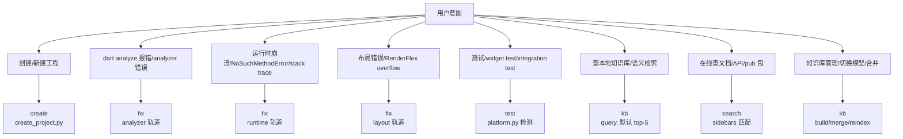
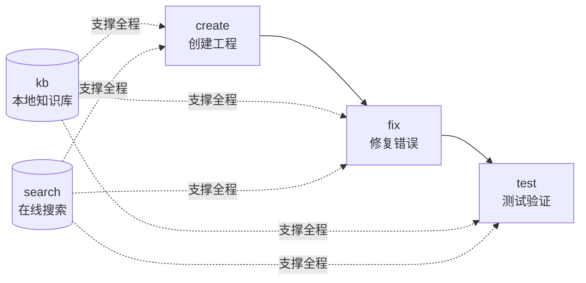

# FLUTTER-DEV —— Flutter/Dart 应用开发技能

五个子命令覆盖 Flutter 应用开发全生命周期：create（创建工程）→ fix（修复错误）→ test（测试验证），辅以 kb（本地知识库）与 search（在线文档搜索）作为知识支撑。

- **create**（上游）— Python subprocess 调用 `flutter create`，项目名/组织名/平台校验 + 输出目录生成。解决"工程**怎么起**"。
- **fix**（修复）— 聚合三套修复轨道：analyzer（`dart analyze` 静态错误码路由）、runtime（Dart stack trace 解析）、layout（RenderFlex overflow / unbounded constraints / missing Material ancestor）。按症状路由。解决"**错了怎么改**"。
- **test**（验证）— 平台检测 + Flutter SDK/Dart SDK 探测 + `flutter test`（单元/widget 测试）+ `flutter integration_test`（集成测试）。所有平台全功能（Flutter 跨平台，无 MCP 依赖）。解决"**对不对**"。
- **kb**（知识库）— 本地 Qdrant 知识库，3 类 sidebar 文档分类存储（docs/api/ai-docs），向量嵌入（默认 `paraphrase-MiniLM-L3-v2`，ModelScope/云端可切换）+ bm25 关键词索引 + 可选 FlashRank 重排。description 懒填充 + 向量回填 + 双向链接。子动作：query/build/merge/reindex/update-description/update-links/link-auto/migrate-embed-model/config。解决"**本地能查什么**"。
- **search**（在线搜索）— 本地 sidebars 关键词匹配 + URL 内容抓取（docs.flutter.cn / api.flutter-io.cn / pub.dev），HTML→Markdown 清洗。作为 kb description/链接填充的合法通道之一。解决"**网上有什么**"。

## 子命令路由

**TL;DR 决策树**(快速路由,完整流程见下表):



| 用户意图                                       | 子命令   | 完整流程                                                          |
| ---------------------------------------------- | -------- | ----------------------------------------------------------------- |
| 创建 / 新建 Flutter 工程（从零/脚手架）        | create   | [`references/commands/create.md`](references/commands/create.md) |
| dart analyze 错误 / 类型错误 / 静态检查报错    | fix      | [`references/commands/fix.md`](references/commands/fix.md)        |
| 运行时崩溃 / NoSuchMethodError / stack trace   | fix      | [`references/commands/fix.md`](references/commands/fix.md)        |
| 布局错误 / RenderFlex overflow / 布局异常      | fix      | [`references/commands/fix.md`](references/commands/fix.md)        |
| Dart 语法问题 / TS→Dart 差异 / 是否允许某语法  | fix      | [`references/commands/fix.md`](references/commands/fix.md)        |
| Widget / 布局 / 状态管理 / Flutter UI 代码     | kb       | [`references/commands/kb.md`](references/commands/kb.md) + `references/flutter-ui/` |
| 单元测试 / widget test / integration test       | test     | [`references/commands/test.md`](references/commands/test.md)      |
| 查询本地知识库 / Flutter 文档语义检索           | kb       | [`references/commands/kb.md`](references/commands/kb.md)          |
| 在线搜索 Flutter 文档 / 查 API / 查 pub 包     | search   | [`references/commands/search.md`](references/commands/search.md)  |
| 知识库管理（构建/合并/重索引/切换模型）         | kb       | [`references/commands/kb.md`](references/commands/kb.md)          |

进入子命令后，按其流程文档执行。检查点、边界情形、交付核对清单均在各子命令文档内 —— **本路由器不含流程主体**。

## 快速命令参考

```bash
# create
python3 -m scripts.create.create_project --name <project_name> --out <输出目录> [--org com.example] [--platforms android,ios,web]

# fix（三轨道: analyzer→run_analyzer.py | runtime→parse_stack_trace.py | layout→diagnose_layout.py）
python3 -m scripts.fix.run_analyzer --project <dir>            # dart analyze JSON 解析
python3 -m scripts.fix.parse_stack_trace --trace "<stack trace string>"
python3 -m scripts.fix.diagnose_layout --log "<flutter layout error log>"

# test
python3 -m scripts.test.cli check                               # 检测 Flutter/Dart SDK + 平台
python3 -m scripts.test.cli run --unit --path test/             # flutter test（单元/widget）
python3 -m scripts.test.cli run --integration --path integration_test/  # flutter integration_test

# kb（9 子动作）
python3 -m scripts.kb.cli query --question "<关键词>" [--top-k 5]
python3 -m scripts.kb.cli build
python3 -m scripts.kb.cli merge --other <other.qdrant>
python3 -m scripts.kb.cli reindex --force
python3 -m scripts.kb.cli update-description <id> "<desc>"
python3 -m scripts.kb.cli update-links --id <id> --content "<markdown>"
python3 -m scripts.kb.cli link-auto [--threshold 0.9] [--max-per-doc 10]   # 余弦>0.9 自动双向链接
python3 -m scripts.kb.cli migrate-embed-model [--model <name>]              # 回填 embed_model
python3 -m scripts.kb.cli config

# search
python3 -m scripts.search.search "<关键词>" [--doc-type docs|api|ai-docs] [--top-k 10]
python3 -m scripts.search.detail <url>

# 一键重建预构建库（切换 embed_model 后必跑）
python3 scripts/kb/build_db.py
```

## 通用规则

### 开发规则（Dart / Flutter API / UI）

`create` 子命令生成工程代码、`fix` 子命令的 grammar 轨道、`test` 的 `flutter analyze` 都 MUST 遵循 [`references/dev-rules.md`](references/dev-rules.md)。该文件包含三类强制规则：
1. **Dart 语言规范**（类型系统/空安全/异步/模式匹配/枚举/类/mixin/泛型，约 40 条）
2. **Flutter API 使用规范**（Widget 生命周期/BuildContext/State 管理/路由/主题/dispose，约 15 条）
3. **Flutter UI 规范**（Material 3/Cupertino/响应式/无障碍/性能，约 10 条）

### 平台检测

test 子命令经 `python3 -m scripts.test.cli check` 检测 Flutter SDK / Dart SDK / 平台。Flutter 跨平台，所有平台（Linux/Windows/macOS）都支持 `flutter test` + `flutter integration_test`，无 MCP 依赖。

### config.json 驱动

`config.json` 记录 embed_model/rerank_model/db_path/endpoints。
- 文件缺失 → agent 经 AskUserQuestion 询问配置项；选默认则生成默认 config.json 并用预构建库；非默认则下载模型+重索引。
- embed_model 为默认值且 data/flutter.qdrant 存在 → 直接用预构建库，不重算向量。
- embed_model 非默认 → 下载模型 + 全量重索引。

> 🔴 **CHECKPOINT**：修改 `embed_model` / `embed_dim` 后 MUST 运行 `python3 scripts/kb/build_db.py` 全量重建向量库。未重建直接 query 会因维度不匹配报错。此规则同样适用于 `rerank_model` 切换后未 reindex 的情况。

### description 懒填充

kb query 命中文档但 description=="无描述"时，agent 调 `search detail <url>` 取正文 → 生成 ≤200 字 description → 调 `kb update-description <id> "<desc>"` 回填 + 重算向量。

> 🔴 **CHECKPOINT**：`kb merge` 完成后,新库需 `reindex --force` 刷新 description 变化文档的向量。**禁止**在未验证新库查询正确前删除旧库备份。备份文件 `.bak.<timestamp>` 需用户显式确认后才能删除。

## 完整流程链路



**协同要点**：kb query 命中无 description → search detail 取正文 → 回填 description + 双向链接；fix 遇未知 API → search 查官方文档；test 失败 → 错误日志 → fix 轨道诊断。

## 失败模式与 fallback

| 触发条件 | 一线修复 | 仍失败兜底 |
| -------- | -------- | ---------- |
| config.json 缺失 | agent 经 AskUserQuestion 询问，选默认则生成默认配置 | 用户拒绝配置则停止，提示手动编辑 config.json |
| 预构建库不存在 | 调 `kb build` 从 sidebars/ 重建 | sidebars/ 缺失则提示用户从 temp/ 复制 |
| kb query 无结果 | 换关键词或调 `search` 在线搜索 | search 也无结果则建议直访 docs.flutter.cn |
| kb query 报维度不匹配 | embed_dim 改了未 rebuild → 跑 `python3 scripts/kb/build_db.py` | 仍报错则检查 config.json 的 embed_dim 与模型实际维度 |
| search URL 抓取失败（HTTP 5xx/超时） | 显式报错（非零退出码 + errors 字段），不静默 | 切换另一端点重试；多端点失败则建议直访官网 |
| search detail content 为空 | 检查 URL 是否过期或需登录 | 告知用户并提供原始 url 供手动访问 |
| ModelScope 模型下载失败（404/超时） | 重试 + 检查模型名拼写（如 `+` 后缀非法） | 提示手动下载或切换 `openai://` 云端模型 |
| Flutter SDK 未安装（test check 报 `Flutter SDK: 未检测到`） | 提示 `flutter.dev/docs/get-started/install` 安装 | 安装后重跑 `check` 验证 |
| fix 症状歧义 | 按 analyzer → runtime → layout → grammar 顺序 fallback | 询问用户提供更明确症状（错误码/堆栈/截图） |
| sidebars/ 解析出 0 条文档 | 检查 sidebars/ 目录是否非空 + markdown 格式是否合法 | 提示用户从 temp/flutter-*-sidebar.md 重新复制 |
| kb query 报 `embed_model mismatch` | DB 用的模型与当前 config.json `embed_model` 不一致 → 二选一：①改 config.json 回到 DB 模型；②跑 `python3 scripts/kb/build_db.py` 用新模型全量重建 | 同维度不同模型向量空间不兼容，禁止仅改 embed_dim 蒙混 |
| kb merge 报 `embed_model mismatch` | 两 DB 用了不同 embed_model → 拒绝合并。先对两库分别 reindex 到同一模型再 merge | 已污染库需 `build_db.py` 从 sidebars 重建 |
| DB docs 缺 `embed_model` 字段（legacy 库） | 跑 `python3 -m scripts.kb.cli migrate-embed-model` 回填 config.json 的 embed_model | 已被多模型污染（mixed）只能 `build_db.py` 重建 |
| docs `links=[]` 无邻居 | 跑 `python3 -m scripts.kb.cli link-auto` 按 cosine >0.9 自动建立双向链接 | 仍 0 邻居说明 docs 向量彼此正交，检查 embedder 是否正常 |

## 禁止事项（反例黑名单）

1. **禁止硬编码模型名/路径** — embed_model/rerank_model/db_path 全部从 config.json 读，禁止脚本内硬编码。
2. **禁止跨子命令直连** — create 产出的工程不经 fix/test 验证不算完成；kb 的 description 回填不调 search detail 算违规。
3. **禁止简化实现** — 双向链接必须真正双向写入；description 回填必须重算向量；合并必须字段级 update_at 比较。
4. **禁止静默吞错** — 所有脚本错误显式上报（非零退出码/errors 字段/异常），不藏默认值背后。
5. **禁止跨模型向量空间混用** — 同维度不同 embed_model 的向量空间不兼容。query/merge/reindex 入口 MUST 校验 embed_model 一致；mismatch 时 fail-loud，禁止"维度相同就放过"。新库 MUST 跑 `migrate-embed-model` 回填 embed_model 字段；老库迁移完成后 MUST 跑 `link-auto` 建立默认双向链接。

## 平台支持矩阵

| 子命令 | Linux | Windows | macOS |
| ------ | ----- | ------- | ----- |
| create | ✅ | ✅ | ✅ |
| fix | ✅ | ✅ | ✅ |
| test（单元/widget） | ✅ | ✅ | ✅ |
| test（integration） | ✅ | ✅ | ✅ |
| kb | ✅ | ✅ | ✅ |
| search | ✅ | ✅ | ✅ |
